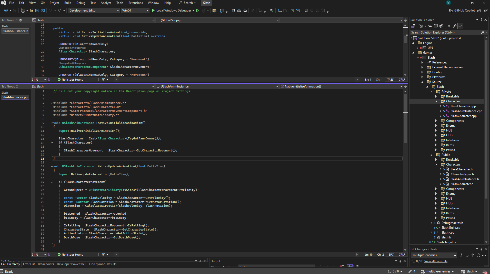

# Slash

# Project Title

Project delevoped using Unreal Engine version 5.2 during the Unreal Engine 5 C++ The Ultimate Game Developer Course created and taugh by [Stephen Ulibarri](https://www.udemy.com/user/stephen-ulibarri-3/). 

## Table Of Content
* [About The Project](#about-the-project)
* [Skills Learned](#skills-learned)
  * [Melee Attack](#melee-attack)
  * [Motion Warping](#motion-warping)
  * [Enemy Behavior](enemy-behavior)
* 

## 🕹️ About The Project
In this project, a third-person character, called Slash, was developed to walk around an open world map, have combat skills and defeat enemies inside a dungeon full of enemies and a final boss.

## Lessons Learned

What did you learn while building this project? What challenges did you face and how did you overcome them?

## 🎯 Skills Learned
While following the course and building this project, I was able to develop skills in Unreal Engine, game development, refresh some C++ concepts as well as get used to how UE make use of abstractions to simplify the code in general.
I have also encountered many challenges while implementing extra features such as more enemy animations, lock on target mechanic, work with NavMesh Bounds Volume, and so on. I'll list below some skills that really impressed me while I was learning.

### Animation Montage and Animation Blueprint
Animation Blueprint (ABP) allows the usage of data and logic to determine which animation to play. To make use of the data, we need to grab a reference of the character that has the skeletal mesh using the ABP. In order to do that, the returning pawn has to be casted and set to a pointer of the character class type we're using, called SlashCharacter:

With its reference we can now get all data we need to use in the ABP and update the output pose based on logic. State Machines hold the logic, and having many State Machines is better than having a single one with many states and transition rules, that can easily become confusing. Another way to keep things organized is to use Linked Anim Graph node that lets us use animations blueprint within another. In this project there's a main ABP, ABP_Echo, that uses two other animations blueprints, ABP_Echo_MainStates, and ABP_Echo_IK.

ABP_Echo SCREENSHOT  
ABP_Echo_MainStates

### Motion Warping

### Enemy Behavior
GIF/VIDEO

The enemy class was the longest to develop, meaning there was a lot to learn and implement. In this project the AI behavior was implemented with methods using states to check what was the current state in order to play a certain animation or to choose another.

## Acknowledgements

 - [Awesome Readme Templates](https://awesomeopensource.com/project/elangosundar/awesome-README-templates)
 - [Awesome README](https://github.com/matiassingers/awesome-readme)
 - [How to write a Good readme](https://bulldogjob.com/news/449-how-to-write-a-good-readme-for-your-github-project)

## Features

- Light/dark mode toggle
- Live previews
- Fullscreen mode
- Cross platform

## Authors

- [@octokatherine](https://www.github.com/octokatherine)

