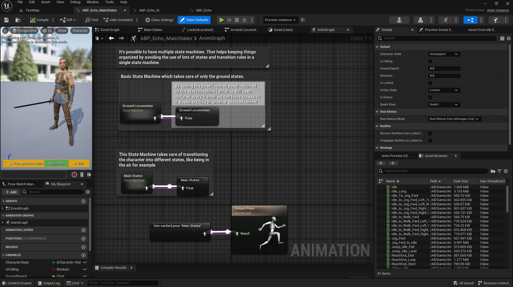

# UE5/C++ Slash Project

Project delevoped using Unreal Engine version 5.2 during the Unreal Engine 5 C++ The Ultimate Game Developer Course created and taugh by [Stephen Ulibarri](https://www.udemy.com/user/stephen-ulibarri-3/).


## Table Of Content

- [About The Project](#about-the-project)
- [Skills Learned](#skills-learned)
  - [Animation Montage and Animation Blueprint](#animation-montage-and-animation-blueprint)
  - [Motion Warping](#motion-warping)
  - [Enemy Behavior](#enemy-behavior)
  - [Lock On Target](#lock-on-target)
  - [Speed up](#speed-up)


## 🕹️ About The Project

In this project, a third-person character, called Slash, was developed to walk around an open world map, have combat skills and defeat enemies inside a dungeon full of enemies and a final boss.


## 🎯 Skills Learned

While following the course and building this project, I was able to develop skills in Unreal Engine, game development, refresh some C++ concepts as well as get used to how UE make use of abstractions to simplify the code in general.
I have also encountered many challenges while implementing extra features such as more enemy animations, lock on target mechanic, work with NavMesh Bounds Volume, and so on. I'll list below some skills that really impressed me while I was learning.

### Animation Montage and Animation Blueprint

#### 🧩 Animation Montage:

In this project many animations were used and the majority of them were combined in many animation montages (AM) so it could be controlled through C++ code as well as Blueprint script.

I've learned how to add and split sections so I could decide when to play an animation based on conditions in the code (like the current state of the character);  
Add events using notifies in order to control box collision for the weapon during attack montages, to identify the end of each animation sequence. Use notifies to also add sounds, and motion warping windows which can direct the root motion towards a set target.


#### 🧩 Animation Blueprint (ABP):

It allows the usage of data and logic to determine which animation to play. To make use of the data, we need to grab a reference of the character that has the skeletal mesh using the ABP. In order to do that, the returning pawn has to be casted and set to a pointer of the character class type we're using, called SlashCharacter:


With its reference we can now get all data we need to use in the ABP and update the output pose based on logic. State Machines hold the logic, and having many State Machines is better than having a single one with many states and transition rules, that can easily become confusing. Another way to keep things organized is to use Linked Anim Graph node that lets us use animations blueprint within another. In this project there's a main ABP, ABP_Echo, that uses two other animations blueprints, ABP_Echo_MainStates, and ABP_Echo_IK.





### Motion Warping

As mentioned above, Motion Warping is added to an animation sequence in animation montage through notifies. To use this feature, we need to enable the Motion Warping plugin, use animations that has root motion enabled, meaning the skeletal mesh must have a root bone to make it all work, and add a motion warping component to the character's blueprint. In this project, we use two motion warpings: one that warps the root motion translation component and another that warps the rotation component.

For this project, motion warping is used when a character has a valid combat target, making the attack animation warp to that target location. In the event graph of the character using a motion warping component, every frame we'll check whether there's a combat target. If so we'll call a custom function we created in C++, GetTransLationWarpTarget and hook the return value to the Add Or Update Warp Target from Location node from the motion warping component. That node also needs the warp target name which in this case corresponds to the motion warping named TranslationTarget. After that we'll call another function we've implemented GetRotationWarpTarget and use the return value to the next Add Or Update Warp Target from Location node which now uses the motion warping named RotationTarget that will make the character face the target.


### Enemy Behavior

GIF/VIDEO

The enemy class was the longest to develop, meaning there was a lot to learn and implement. The AI behavior was implemented with methods using states to check what was the current state in order to play a certain animation or to choose another one. We also make use of Navigation Mesh and Target Points that are used as patrol targets.  
I've added an extra animation to the Paladin enemy, so during patrol time it would play an "idle patrol" animation instead of just staying in the idle animation until it moves to the next target:  

📹
  


#### 🐞 Bugs

I've spent a good amount of time trying to debug an issue when we implemented a second enemy, a Raptor. The bug really annoyed me because even though this new enemy was a child of the Enemy C++ class, the first enemy created, BP_Paladin, would not have the bug.
It happens that the Raptor stopped patrolling after some time doing it. So I've used debug spheres, placing in the Raptor's location and the next patrol target to figure out what was wrong. I checked it stopped choosing the next patrol target out of the patrol targets array.

After long hours trying the issue, the solution was in finding the best Capsule Componenet shape. I've noticed that tweaking both Capsule Radius and Capsule Half Height, the enemy would finally choose the next patrol target to move to. That also happened when I later added another enemy, BP_Vampire which was even bigger than the Raptor, but that time I knew all I had to do was adjust the Capsule Componenet shape.

🎥 Check the video below where I demonstrate the bug and use debug sphere to show the location of the raptor as the patrol targets:

[](https://www.youtube.com/watch?v=bsPqVMfWcHY)

🐞🐞

Another bug that costed me days to find a solution was the navigation mesh. It all started when I was trying to get rid of some gaps in the NavMesh Bounds Volume and tried to change some parameters in Project Settings and Editor Preferences 🥲.  
After trying some solutions found in forums and YouTube videos, I got some help from a Discord channel and found out that all I had to do was adjust the Agent Max Slope and Agent Max Step Height values in the RecastNavMesh-Default actor.  
However, Agent Max Step Height was too high and I've encoutered another issue while editing the open world level: the NavMesh showed some weird patterns which I found out later it was caused by a property, in the geometry blueprint I used to populate the world, under Collision > Advanced: Can Ever Affect Navigation. I could find that property when selecting one of the Instanced Static Mesh that composes the geometry blueprint. By setting it to false, the NavMesh would not be affected anymore by that geometry and I could also set a much lower value to the Agent Max Step Height. Also, edit the Landscape also helped (specially smoothing the surface).


### Lock On Target

I've implemented the Lock on target mechanic as part of the course challenges along the sections. To accomplish this I have a sphere trace method which uses a Kismet System Library function: SphereTraceSingleForObjects to set the a variable CombatTarget to the actor hit.  
I'll check whether that actor is an Enemy by setting a tag to the Enemy during initialization and checking it in the LockToTarget method. To lock the camera to the enemy, I'll set the controller rotation from the player character to the target (using FindLookAtRotation). I also disable Look input by calling SetIgnoreLookInput from the Controller in LockToTarget.  
Those methods are triggered when the player presses TAB. To unlock, the player should also press TAB, so the function bound to that key will be called and check whether it's already locked or not to proceed with the correct action.  
You can check the code below:

```cpp
void ASlashCharacter::SphereTrace()
{
	const FVector SlashLocation = GetActorLocation();
	FVector CameraFwd = ViewCamera->GetForwardVector();
	FVector End = (CameraFwd * 500.f) + SlashLocation;

	// Objects to trace against
	TArray<TEnumAsByte<EObjectTypeQuery>> ObjectTypes;
	ObjectTypes.Add(UEngineTypes::ConvertToObjectType(ECC_Pawn));

	TArray<AActor*> ActorsToIgnore;
	FHitResult HitActor;

	UKismetSystemLibrary::SphereTraceSingleForObjects(
		this,
		SlashLocation,
		End,
		125.f,
		ObjectTypes,
		false,
		ActorsToIgnore,
		EDrawDebugTrace::ForDuration,
		HitActor,
		true
	);

	CombatTarget = HitActor.GetActor();
}

void ASlashCharacter::LockTarget()
{
	if (CanLock())
	{
		// Engage lock
		SphereTrace(); // CombatTarget set to enemy
		LockToTarget();
	}
	else
	{
		// Disangaged lock
		UnlockFromTarget(); // Enemy set to nullptr
		ActionState = EActionState::EAS_Unoccupied;
	}
}

bool ASlashCharacter::CanLock()
{
	return !bLocked && CharacterState > ECharacterState::ECS_Unequipped;
}

bool ASlashCharacter::IsTargetEnemy()
{
	return CombatTarget && CombatTarget->ActorHasTag(FName("Enemy"));
}

void ASlashCharacter::LockToTarget()
{
	if (IsTargetEnemy())
	{
		// add a state so it can be used in transition rule from unlocked to locked locomotion
		ActionState = EActionState::EAS_Locked;
		bLocked = true;
		bIsEnemy = true;
		
		Enemy = Cast<AEnemy>(CombatTarget);
		if (Enemy) Enemy->ShowLockedEffect();

		GetCharacterMovement()->bOrientRotationToMovement = false;
		GetCharacterMovement()->bUseControllerDesiredRotation = true;

		Controller->SetIgnoreLookInput(bLocked);
	}
}

void ASlashCharacter::UnlockFromTarget()
{
	bLocked = false;
	CombatTarget = nullptr;
	bIsEnemy = false;

	if (Enemy)
	{
		Enemy->HideLockedEffect();
		Enemy = nullptr;
	}

	GetCharacterMovement()->bOrientRotationToMovement = true;
	GetCharacterMovement()->bUseControllerDesiredRotation = false;

	Controller->ResetIgnoreLookInput();
}

void ASlashCharacter::Tick(float DeltaTime)
{
	Super::Tick(DeltaTime);

	if (Attributes && SlashOverlay)
	{
		Attributes->RegenStamina(DeltaTime);
		SetHUDStamina();
	}
	if (bLocked && Enemy && !Enemy->IsDead())
	{
		FVector SlashLocation = GetActorLocation();
		FVector LockedTargetLocation = CombatTarget->GetActorLocation();

		Controller->SetControlRotation(UKismetMathLibrary::FindLookAtRotation(SlashLocation, LockedTargetLocation));
	}
	if ((Enemy && Enemy->IsDead()) || IsOutOfRange())
	{
		UnlockFromTarget();
	}
}

bool ASlashCharacter::IsOutOfRange()
{
	if (CombatTarget)
	{
		const FVector SlashLocation = GetActorLocation();
		const FVector LockedTargetLocation = CombatTarget->GetActorLocation();

		double Distance = FVector::Dist(LockedTargetLocation, SlashLocation);

		return Distance > Range;
	}

	return false;
}

```  

  

### Speed up
This was also an extra feature added where I've bound the SHIFT key to a method that increases the character speed, but also consumes stamina. The method checks whether the stamina is greater than 10% of the total value, otherwise it won't let increase the speed.

🎥

[](https://www.youtube.com/watch?v=NecmTkvi358)